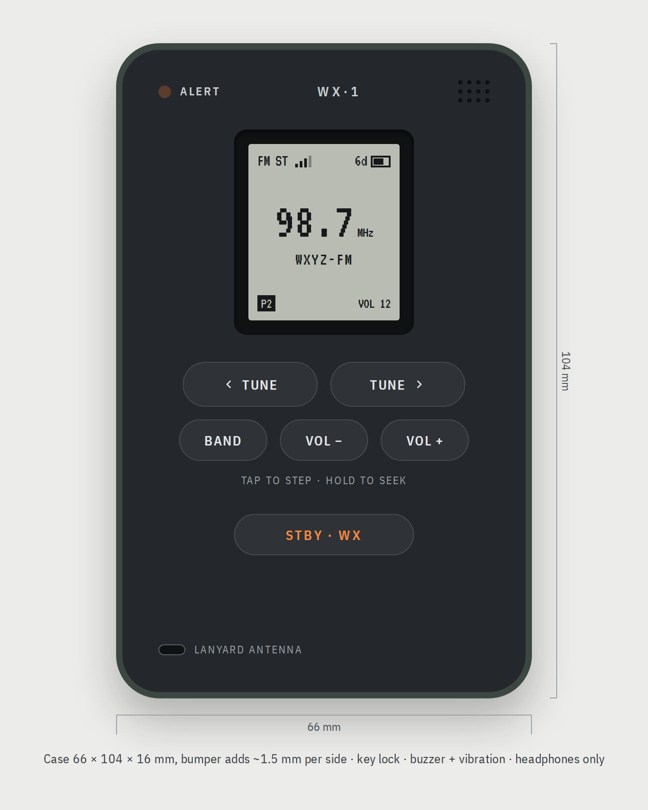
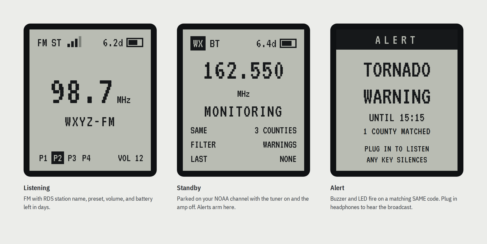
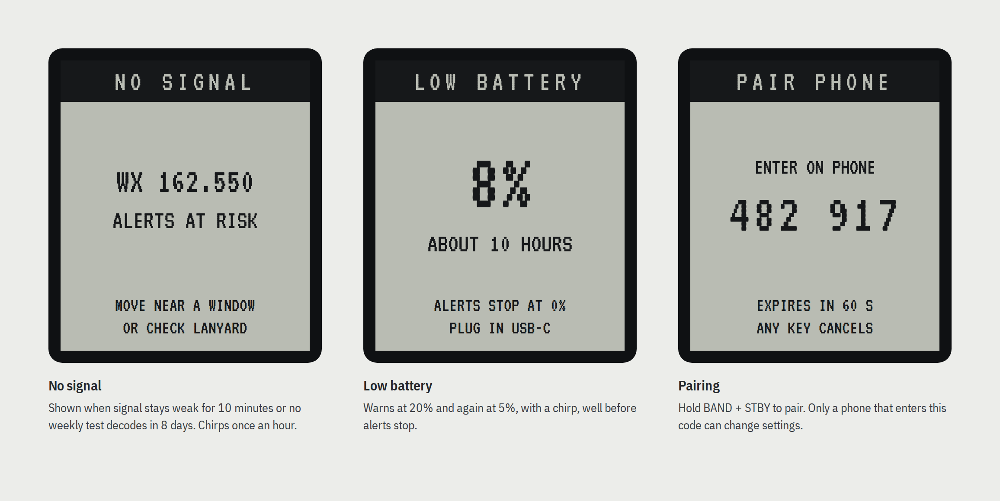
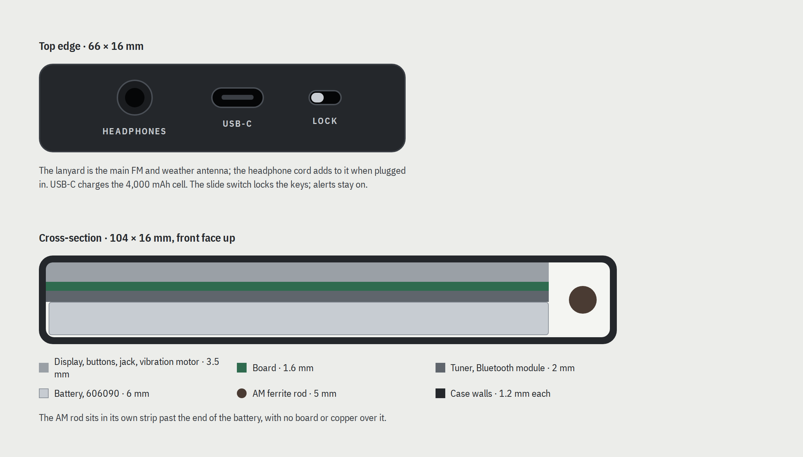
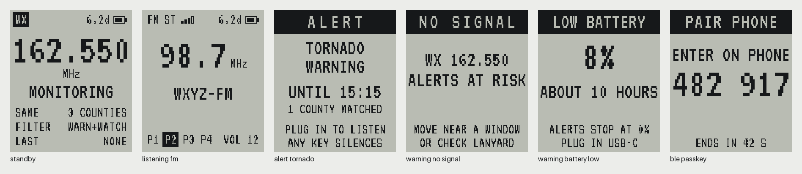
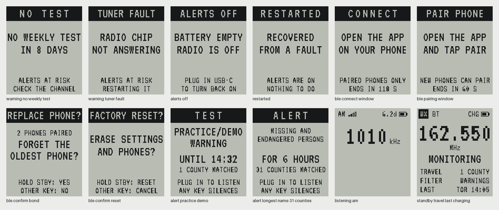

# samewise

Firmware and iPhone setup app for **Pocket WX Radio**, a pocket AM/FM/NOAA weather radio that decodes SAME alerts. It sounds the buzzer for a warning in your counties and never misses one quietly: anything that could stop alerts puts a warning on the screen.

The hardware is a Raytac MDBT50Q-1MV2 (nRF52840) and a Skyworks Si4743 tuner. The firmware runs on Zephyr through the nRF Connect SDK, and every part of it also builds for `native_sim`, so the tests run on a laptop.

## What it will look like

These images come from the design canvas ([Pocket WX Radio](https://claude.ai/artifact/H2KN9YqryhzZg26dVN7VKe)). The hardware doesn't exist yet, so this is the target, not a photo.

<p align="center"></p>

**Display states.** Listening to FM, standby on the NOAA channel with alerts armed, and an alert.



**Warnings and pairing.** Each condition that puts alerts at risk has its own screen. Pairing shows a passkey that you type on the phone.



**Top edge and cross-section.** Headphone jack, USB-C and the key-lock switch are on the top edge. Inside, the AM ferrite rod has a strip of its own beyond the 4,000 mAh cell.



## The screens, as built

The firmware draws every screen from its screen model in the design's VT323 font, and the tests hold each one to a golden image. These are those images, in the LCD's colours. The six screens of the design:



And the ones the design didn't cover: the other warnings, ALERTS OFF, RESTARTED, the Bluetooth windows and confirmations, a test alert, the longest event name with 31 counties, AM, and travel mode while charging.



All 26 are in [`docs/images/screens`](docs/images/screens); the spec's [Screens](docs/firmware-spec.md#screens) section says what each shows.

## Status

| Milestone | Scope | State |
| --- | --- | --- |
| [1](docs/MILESTONE-1.md) | HAL, fakes, SAME generator, decoder and parser | Done |
| [2](docs/MILESTONE-2.md) | Matcher, alert manager, health supervisor, scenarios | Done |
| [3](docs/MILESTONE-3.md) | Bluetooth settings service, bsim tests, macOS mock radio | Done |
| [3.5](docs/MILESTONE-3.5.md) | XIAO nRF52840 build, size budget, Renode bench ([report](docs/xiao-bench.md)) | Done |
| [App 1](docs/MILESTONE-APP-1.md) | iPhone setup app against the mock radio | Done, pairing checks wait for the board |
| [3.6](docs/MILESTONE-3.6.md) | Every screen, display, battery and tuner drivers against emulated chips | Done |
| 4 | Firmware on the XIAO hardware | Waiting for the board |

[`docs/firmware-spec.md`](docs/firmware-spec.md) is the source of truth ([living version](https://claude.ai/code/artifact/58a9a1a9-ee83-45a4-9799-a0010c75ddac)). The decoder's noise tolerance is measured in [`docs/decoder-snr.md`](docs/decoder-snr.md).

## Layout

```
app/                    firmware: main.c, app logic, services, HAL headers, drivers, native_sim fakes
  services/same/        SAME decoder and parser (plain C99)
  services/match/       event matcher, filter, duplicates
  services/ble/         Bluetooth settings service; gatt_table.h is the GATT source of truth
  services/gfx/         drawing and the VT323 bitmap fonts
  src/app/screens.c     every screen, drawn from the screen model
  drivers/              display, battery and tuner drivers, clock, watchdog, storage
tests/                  ztest suites (twister on native_sim); tests/bsim on nrf52_bsim; tests/renode;
                        tests/drivers against emulated chips; tests/display/screens golden images
swift/GattModel/        Swift codec, TZ parser and radio model shared by the app and the mock
swift/SamewiseKit/      the iPhone app's logic, tested with swift test
ios/Samewise/           the iPhone app (SwiftUI, XcodeGen); see its README
tools/mock-peripheral/  macOS stand-in for the radio over Bluetooth
tools/samegen/          synthetic SAME generator
tools/vectors/          WAV test vectors (git LFS) with JSON sidecars
tools/counties/         builds the app's county table from the Census FIPS lists
tools/fonts/            VT323 and the font generator; tools/display: goldens and PNG renders
docs/                   spec, milestones, reports, gatt.json
```

## Build and test

Workspace setup, from the directory that contains this repository:

```
west init -l samewise && west update --narrow -o=--depth=1
```

The pinned NCS needs Python 3.12 or newer. Install `zephyr/scripts/requirements-{base,build-test,run-test}.txt` and `tools/requirements.txt`. `native_sim` needs `gcc-multilib`; without the Zephyr SDK, set `ZEPHYR_TOOLCHAIN_VARIANT=host`.

```
west build -b native_sim app -p auto
./build/app/zephyr/zephyr.exe --stop_at=1
west twister -T tests -p native_sim
python3 -m unittest discover -s tools -p 'test_*.py'
tests/bsim/run.sh                                      # Bluetooth on nrf52_bsim (BabbleSim)
west build -b xiao_ble/nrf52840 app -d build-xiao      # needs the Zephyr SDK's ARM toolchain
(cd swift/GattModel && swift test)                     # also runs on Linux
(cd swift/SamewiseKit && swift test)                   # also runs on Linux
(cd tools/mock-peripheral && swift run MockPeripheral --open) # macOS; --open for the iPhone
(cd ios/Samewise && xcodegen)                          # macOS; then open Samewise.xcodeproj
```

[`CLAUDE.md`](CLAUDE.md) covers BabbleSim, Renode and the rest of the setup. The iPhone app's own instructions are in [`ios/Samewise/README.md`](ios/Samewise/README.md).

## SAME in brief

The NWS sends SAME at 520.83 baud with AFSK tones: mark 2,083.33 Hz, space 1,562.5 Hz. Each header (`ZCZC-ORG-EEE-PSSCCC…+TTTT-JJJHHMM-LLLLLLLL-`) is sent three times, and the radio votes across the copies. 47 CFR 11.31 defines the format. The radio only receives; it never transmits SAME audio.
